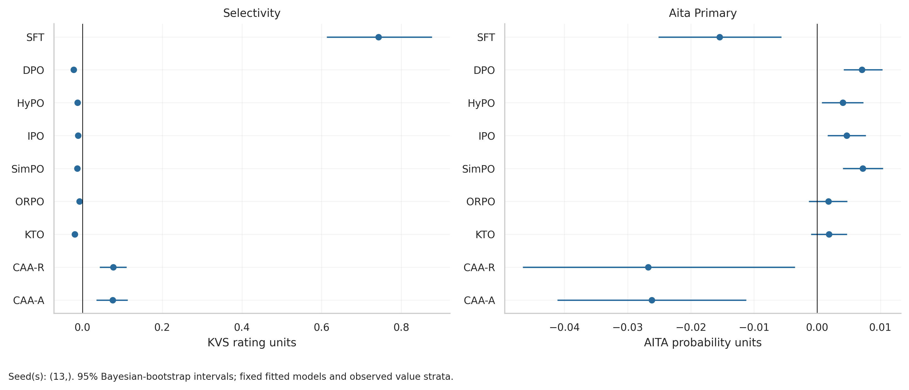

# Lightweight Value Alignment: From Survey Editing to Behavioral Transfer

A University of Bonn NLP Lab project comparing nine lightweight interventions on **Qwen2.5-7B-Instruct**. The benchmark asks whether changing a model's answers to value-survey questions also changes its judgments in realistic moral scenarios.

The main experiment **reduces endorsement of one target value at a time**. It compares target-specific interventions with a separate control for each method, using KVS for supervision and intrinsic evaluation and AITA for external evaluation.

## Research questions

1. **Effectiveness:** Which methods reduce endorsement of the target value?
2. **Selectivity:** How much do other values change unintentionally?
3. **Transfer:** Do survey-level changes carry over to judgments on AITA scenarios?
4. **Efficiency:** What training, memory and inference costs accompany these changes?

This is a comparative study, not a claim of exact replication of a previous paper. AITA judgments are behavioral proxies, not observations of real-world actions.

## Repository contents

| Path | Purpose |
| --- | --- |
| [`value_alignment_benchmark_colab.ipynb`](value_alignment_benchmark_colab.ipynb) | Full data preparation, training, steering, evaluation and reporting workflow |
| [`value_alignment_results_analysis_only.ipynb`](value_alignment_results_analysis_only.ipynb) | CPU-only analysis of saved predictions; no teacher calls, training or model inference |
| [`value_alignment_benchmark/input/`](value_alignment_benchmark/input/) | Source KVS and AITA JSON files |
| [`value_alignment_benchmark/manifests/`](value_alignment_benchmark/manifests/) | Configuration, provenance and run metadata |
| [`value_alignment_benchmark/results/aggregate/`](value_alignment_benchmark/results/aggregate/) | Saved aggregate results |
| [`value_alignment_benchmark/paper_analysis/`](value_alignment_benchmark/paper_analysis/) | Saved figures, CSV/LaTeX tables and analysis reports |

**Current snapshot:** notebooks, input data, manifests and reports are included. The complete runtime artifact tree—including teacher caches, `files.pkl`, model checkpoints, frozen baselines and raw prediction files—is not included. Reading the committed reports requires no GPU; regenerating every report requires the corresponding runtime artifacts or a fresh experiment.

The main notebook retains its historical `colab` filename and some Colab-oriented Markdown. Its executable configuration uses local paths. Follow the local setup below rather than the older Drive/Secrets instructions.

## Data

### KVS: supervision and intrinsic testing

KVS contains **594 value-survey statements** in 20 refined categories, grouped into 10 targets. The original split is enforced:

| Train | Validation (`eval`) | Test |
| ---: | ---: | ---: |
| 378 | 108 | 108 |

Only training rows enter optimization and steering-vector construction. Validation supports early stopping and steering selection. Test rows are held out for intrinsic evaluation.

### AITA: external testing

The supplied AITA data contains 4,335 raw records. Deduplication within each refined value leaves **4,192 post–value records representing 4,158 unique normalized posts**. Some posts occur under two values. AITA covers 19 refined categories; Humility has no examples.

AITA never enters teacher construction, training, early stopping or hyperparameter selection. Missing categories are reported, not filled with synthetic samples.

### Fixed project taxonomy

| Target value | Refined values |
| --- | --- |
| Self_direction | Self_direction_thought, Self_direction_action |
| Stimulation | Stimulation |
| Hedonism | Hedonism |
| Achievement | Achievement |
| Power | Power_dominance, Power_resources, Face |
| Security | Security_personal, Security_societal |
| Conformity | Conformity_rules, Conformity_interpersonal |
| Tradition | Tradition, Humility |
| Benevolence | Benevolence_caring, Benevolence_dependability |
| Universalism | Universalism_concern, Universalism_nature, Universalism_tolerance, Universalism_objectivity |

## Methods and supervision

A teacher creates a neutral prompt and value-affirming/value-opposing responses from each KVS source. The recorded configuration uses **`z-ai/glm-5.3` through OpenRouter**. Canonical records are cached and reused across methods; this is not a single API request for the entire dataset. Retries and uncached generation can incur additional requests.

For paired methods, the target intervention chooses the opposing response and rejects the affirming response. Non-target rows retain the original ordering as anchors. For example, Self-direction reverses 49 training rows and retains 329 anchors. Anchors encourage preservation but do not guarantee it.

| Method | Mechanism | Target intervention |
| --- | --- | --- |
| SFT | Completion cross-entropy on ratings 1–6 | Target labels become 1; non-target labels retain the frozen model's baseline argmax rating |
| DPO | Logistic preference loss relative to a frozen reference | Reverse target pairs |
| HyPO | Official preference objective with a smooth floor on the reference margin | Reverse target pairs |
| IPO | Squared preference loss with a finite target margin | Reverse target pairs |
| SimPO | Reference-free, length-normalized preference objective | Reverse target pairs |
| ORPO | Chosen-response language modeling plus an odds-ratio preference term | Reverse target pairs |
| KTO | Desirable/undesirable supervision relative to a reference and KL baseline | Keep one deterministic completion per source; flip target labels only |
| CAA-R | Contrastive activation addition at decoder-block output | Add a target-specific opposing-minus-affirming vector |
| CAA-A | Contrastive activation addition at self-attention output | Add a target-specific opposing-minus-affirming vector |

HyPO is imported from the [official implementation](https://github.com/tmllab/2026_ICLR_HyPO), pinned to commit `e552477308a3f5ac518a46b7f56fe77f5a3a994f`; its loss is not reimplemented. The configuration uses `im_gamma=0.0` and `im_tau=0.1`. The other preference trainers use TRL 0.9.6.

### Matched controls

Each trainable method has a control trained on original supervision. Steering controls use coefficient zero. Target effects are measured against the **same method's control**, not a shared SFT checkpoint. A frozen reference used inside a preference objective is distinct from this experimental control.

The single-seed registry contains **9 methods × (10 targets + 1 control) = 99 entries**, comprising 77 trainable-method entries and 22 steering entries. The recorded training seed is **13**. Older notebook prose mentioning 297 runs describes an earlier three-seed plan.

The design matches source scenarios and several training settings, but supervision formats, token exposure, early stopping and actual compute differ across methods.

## Evaluation

Let `I` denote the intervention and `C` its matched control.

| Metric | Definition | Interpretation |
| --- | --- | --- |
| Target Value Rating Drop | Mean `rating(C) − rating(I)` on target KVS items | Higher means stronger intended suppression |
| Non-target Fluctuation / Drift | Mean `abs(rating(I) − rating(C))` on non-target KVS items | Lower means better preservation |
| Selectivity | Target drop minus non-target drift | Summarizes the strength/preservation trade-off |
| AITA primary gain | `−Δp(high) + Δp(low) + 0.5 × Δp(remaining)` | Positive means movement in the intended suppression direction |
| AITA strict gain | `−Δp(high) + Δp(low)` | Sensitivity analysis excluding the remaining stance |

Here `Δp = p(I) − p(C)`. AITA's high/low labels are example-specific value stances among NTA, NEUTRAL and YTA. The primary gain is a **weighted probability-shift score**, not accuracy or the probability of a single event.

KVS uses expected ratings derived from full candidate-completion likelihoods over ratings 1–6 and three prompt variants. Primary aggregation averages within refined values first, then equally across the relevant refined values; method summaries equally average target-level results. Micro averages are additional sensitivity analyses.

The main notebook contains hierarchical bootstrap and per-target FDR reporting. The separate analysis notebook uses **10,000 conditional cluster Bayesian-bootstrap draws** and accounts for repeated AITA posts. Its intervals are conditional on the observed models: one training seed cannot estimate training-seed variability. Consult each output's configuration before interpreting intervals or significance.

## Saved results

The following point estimates come from [`method_summary.csv`](value_alignment_benchmark/results/aggregate/method_summary.csv) and match the analysis run `paper_0726c6bf1530_7df3e726`. Values are rounded; AITA gains are shown in their stored probability-score units, not multiplied by 100.

| Method | Target drop ↑ | Non-target drift ↓ | Selectivity ↑ | AITA primary gain ↑ |
| --- | ---: | ---: | ---: | ---: |
| SFT | 1.0221 | 0.2797 | 0.7425 | −0.0154 |
| DPO | 0.0000 | 0.0219 | −0.0219 | 0.0071 |
| HyPO | 0.0090 | 0.0214 | −0.0125 | 0.0041 |
| IPO | 0.0143 | 0.0252 | −0.0109 | 0.0047 |
| SimPO | 0.0107 | 0.0236 | −0.0128 | 0.0072 |
| ORPO | 0.0150 | 0.0223 | −0.0074 | 0.0018 |
| KTO | 0.0002 | 0.0194 | −0.0192 | 0.0018 |
| CAA-R | 0.3120 | 0.2347 | 0.0773 | −0.0267 |
| CAA-A | 0.1763 | 0.1005 | 0.0758 | −0.0262 |

In this snapshot, SFT has the largest survey-level drop and selectivity, while its average primary AITA gain is negative. This illustrates why survey editing and external transfer must be evaluated separately. Small point-estimate differences do not establish reliable method rankings.

See the [comparison with intervals](value_alignment_benchmark/paper_analysis/paper_0726c6bf1530_7df3e726/main_comparison.csv) and [analysis configuration](value_alignment_benchmark/paper_analysis/paper_0726c6bf1530_7df3e726/analysis_configuration.json).



## Running locally

### 1. Prepare the environment

Use an NVIDIA CUDA GPU for the full benchmark. Install a PyTorch build compatible with your installed driver and verify `torch.cuda.is_available()` before loading the model. The current setup uses 4-bit NF4, double quantization, QLoRA and gradient checkpointing, with bf16 when supported and fp16 otherwise. Memory requirements depend on sequence length and method.

Create a dedicated Python environment, install CUDA-compatible PyTorch, then install the notebook's pinned stack:

```bash
python -m pip install \
  transformers==4.45.2 tokenizers==0.20.3 trl==0.9.6 \
  peft==0.13.2 bitsandbytes==0.45.5 datasets==3.2.0 \
  accelerate==1.6.0 sentence-transformers==3.3.1 pyarrow==17.0.0 \
  scipy==1.13.1 statsmodels==0.14.4 matplotlib==3.9.2 seaborn==0.13.2 \
  scikit-learn==1.5.2 pydantic==2.10.4 tenacity==9.0.0 \
  httpx==0.27.2 tqdm==4.67.1 pyyaml==6.0.2 safetensors==0.4.5 \
  pytest==8.3.4 packaging==24.2
python -m pip install jupyterlab modelscope jinja2 threadpoolctl rich
python -m pip check
jupyter lab
```

Git is needed to obtain the pinned HyPO source. These commands reproduce the declared dependency pins; they are not a cross-platform lockfile. The installation cell in the saved notebook is commented out, while imports occur near the beginning, so install dependencies before running it.

### 2. Configure paths and credentials

In the main notebook, update `LOCAL_ROOT` and the `ExperimentConfig` defaults **before** creating `CONFIG`:

- `root`: your persistent `value_alignment_benchmark` directory.
- `model_name`: a complete local Qwen2.5-7B-Instruct model directory, or `Qwen/Qwen2.5-7B-Instruct` for a Hub download.
- `input_kvs_path` / `input_aita_path`: explicit paths to the JSON files under `input/` if automatic discovery is unsuitable.
- `seeds`: retain `(13,)` for the recorded single-seed protocol.

The configuration also calls ModelScope's `snapshot_download` for `sentence-transformers/all-MiniLM-L6-v2`. For offline execution, replace that call with an existing local encoder path and ensure the base model and official HyPO source are available locally.

The executable teacher code reads `OPENROUTER_API_KEY` from the environment. Set it before launching Jupyter; never place credentials in committed notebook cells or outputs. Confirm teacher-model availability in your account before generation. Changing the teacher or prompts creates a different experiment.

### 3. Prepare supervision

Run dataset loading and taxonomy checks first. The saved notebook currently contains:

```python
TEACHER_DF = pd.read_pickle('files.pkl')
```

`files.pkl` is not included. For a fresh run, replace that loading cell with the existing cached generation function:

```python
if CONFIG.run_teacher_now:
    TEACHER_DF = await generate_teacher_records()
else:
    raise RuntimeError("Enable teacher generation or restore a trusted teacher cache.")
display(TEACHER_DF.head(3))
```

Then run the teacher quality audit, method-view construction, fairness checks and frozen-model baselines. Flagged teacher examples remain in the shared source set and are reported rather than silently filtered.

### 4. Execute the registered stages

After defining the trainers, official HyPO integration, steering functions, evaluators and scheduler, execute stages sequentially:

```python
for stage in ("prepare", "train", "kvs_eval", "aita_eval"):
    while not remaining_tasks(stage).empty:
        run_next(stage)
```

Each call processes one pending entry and writes completion markers. Keep the same configuration and artifact root when resuming. The saved notebook also contains convenience execution cells near its end; use one execution route deliberately instead of blindly running all historical cells.

Run aggregation, statistical analysis, figure generation and completeness checks after all required evaluation stages finish. Use `smoke_test=True` and `paper_run=False` for a small pipeline check; use the opposite settings for the full protocol. Smoke outputs are not paper results.

### 5. Regenerate analysis from saved runtime artifacts

Open `value_alignment_results_analysis_only.ipynb` in a fresh CPU kernel. Set:

```python
PA_ROOT = Path("/absolute/path/to/value_alignment_benchmark")
PA_NAMESPACE = "paper_0726c6bf1530_7df3e726"
PA_ACTIVE_TAG = "0726c6bf1530"
PA_SEEDS = (13,)
```

For a new experiment, use its actual namespace and active tag. The analysis requires cleaned data, raw KVS/AITA prediction Parquets and their `.DONE` files, plus frozen baselines. Run metadata and other artifacts support diagnostics. The analysis checks source coverage and hashes and stops if required inputs are missing; committed aggregate CSVs alone are insufficient.

Run this analysis notebook top to bottom. Outputs are written under `paper_analysis/<namespace>/`, including tables, figures, uncertainty estimates, coverage audits and a reproducibility bundle. Re-running overwrites named reports in that analysis folder.

## Reproducibility and limitations

- **One training seed:** intervals and prompt sensitivity do not replace independent training replications.
- **One base model:** conclusions are specific to this model and configuration.
- **Uneven coverage:** AITA category sizes differ substantially; Humility is missing. Macro/micro sensitivity and coverage tables are provided.
- **Teacher supervision:** automatic checks do not establish perfect label correctness or independent human validation.
- **Different mechanisms:** shared source counts do not imply equal token budgets or actual compute.
- **Conditional findings:** neither positive AITA gain nor value suppression establishes ethical quality, general helpfulness or real-world safety.
- **Partial artifact release:** a fresh clone supports inspection of saved reports, but full replay requires restoring or regenerating the missing runtime artifacts and adapting local paths.

## References and licensing

- [Qwen2.5-7B-Instruct](https://huggingface.co/Qwen/Qwen2.5-7B-Instruct)
- [Official HyPO implementation](https://github.com/tmllab/2026_ICLR_HyPO/tree/e552477308a3f5ac518a46b7f56fe77f5a3a994f)
- [TRL v0.9.6](https://github.com/huggingface/trl/tree/v0.9.6)
- Reference study: *From Value Conditioning to Behavioral Shift: Lightweight Value Alignment of LLMs*.

This snapshot does not include a project-level license. Model, dataset and upstream implementation licenses remain applicable; this README does not grant redistribution rights for third-party materials.
